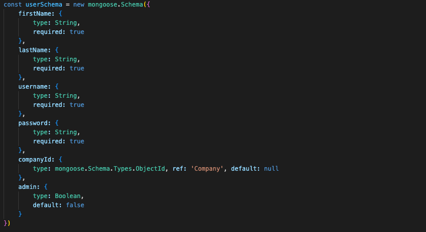
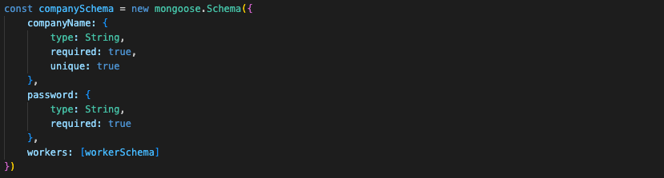
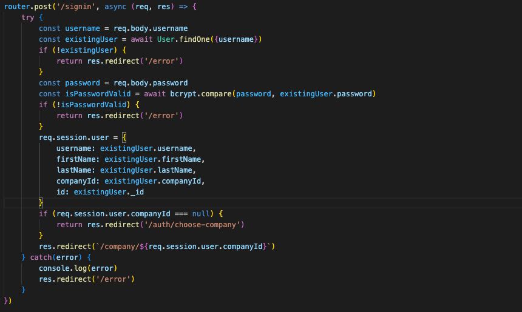
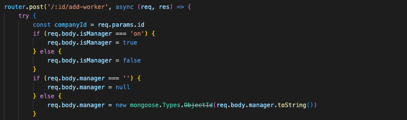
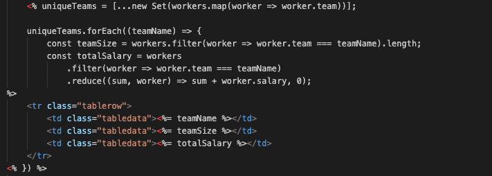

# Team Link

## Description

Team Link is my second development project, where I built on my existing knowledge of HTML, CSS, and JavaScript, while also diving into MongoDB, Express, and EJS for the first time. It’s an HR management app that lets users build and manage their company’s workforce. Having been involved in a Workday implementation as a Business Analyst, I’ve seen firsthand both the capabilities and limitations of a leading HR system. This project was a great opportunity to explore the technical side of that kind of platform and deepen my understanding of how the solutions I once helped define are actually built.

## Deployment Link

[Team Link](https://team-link-phi.vercel.app/)

## Getting Started/Code Installation

1. Clone the GitHub repository:
  - git clone https://github.com/jamiekaye9/team-link
2. Navigate into the project folder:
  - cd team-link
3. Install dependencies:
  - npm install
4. Create an .env file inside the project folder containing:
  - MONGODB_URI=your_mongodb_token
  - PORT=your_port_number
  - SESSION_SECRET=your_secret_key
5. Start the server:
  - npm start

## Timeframe & Working Team

This was a solo project, built in the timeframe of 1 week.

## Technologies Used

EJS, JavaScript, Express, CSS, Bcrypt, Node.js

## Brief

- Build a Node/Express/MongoDB application with full CRUD functionality.
- Utilise EJS Templates for rendering views to users.
- Use session-based authentication.
- The app should have at least one data entity in addition to the User model.
- At least one data entity must have a relationship with the User model.
- Guest users should not be able to create, update or delete data within the application.
- CSS Flexbox is utilised for page layout design.

## Planning

To plan this project, I used MVP User Stories, Stretch Goal User Stories, Wireframes and an ERD. This can all be found in the Trello link below. By creating well-thought-out, detailed wireframes, I was able to replicate them more easily through CSS styling; making the design process more focused and efficient.

[Planning Documentation](https://trello.com/invite/b/67a54527088349ac4dca06e8/ATTI844fb3af6eeffc5084aca4d00188fa9e16219B37/project-2)

## Build/Code Process

I began the project by defining my User and Company models, with the goal of making sure users could only perform CRUD operations within their own company. To achieve this, I used reference-based modelling by adding a companyID field to the User schema. This setup was essential for supporting multiple companies, each with its own isolated workforce — a key step toward making the application suitable for public use.

I then built my first authentication system using Express and bcrypt. Express made it easy to define my routes clearly from the start, helping me map out the app’s structure before building each route in more detail. I also saw how asynchronous functions, though subtle, are key to keeping the code clean and responsive.

Bcrypt gave me my first practical experience adding security at a technical level. It showed me not just how to protect data, but how hashing can safeguard passwords even if data is compromised.

When creating the sign-in route, I focused on securely verifying users, comparing passwords with bcrypt, and setting up sessions that linked users to their companies.

Next, I began adding CRUD functionality for companies and workers. One feature I was especially keen to include was the ability to link workers to a manager using the manager’s ID. This allowed users to assign a manager to a worker within the Add New Worker form, and ensured the manager field would be cleared if that manager was later deleted from the database.

To achieve this, I added an isManager field to the Worker schema. When adding a worker, users can select a manager from a list of workers who have the isManager field enabled. The manager field is then populated with that worker’s object.

Including this feature also sets the foundation for future enhancements, like displaying team hierarchies or manager-specific permissions.

I was keen to create some reporting views to make use of the worker data being collected. One of these was a Teams page, which lists all the unique teams that workers belong to, along with the team size and total salary for each team.

To do this, I first used JavaScript’s Set to pull out unique team names from the list of workers. Then, for each team, I calculated the number of workers (teamSize) and the total salary by filtering the workers by team and summing their salaries.

This highlighted how the more data that’s collected, the more opportunity there is to build useful functionality, provide analysis, and give valuable insights to the end user.

## Challenges

This project taught me a lot about adapting to the limitations of frameworks and databases. For example, when trying to populate a manager field with a worker object, I discovered that MongoDB can only store references as strings (ObjectIDs). To solve this, I learned to convert and store the worker’s ObjectID rather than the entire object — a valuable lesson in working with document databases and designing relationships between models.

Another challenge was working with bcrypt. As this was my first time using a library like bcrypt, I had to get comfortable with the fact that parts of the logic (such as hashing and salting passwords) happen behind the scenes. Over time, I learned to trust these processes while still researching and understanding how they work so I could apply them with confidence.

Styling the application also presented challenges, especially with so many elements on the page. In particular, implementing a sticky vertical navbar (using height: 100vh and position: fixed) made it tricky to manage space for the main content. The navbar took up fixed width, so I had to adjust the layout using display: flex and add padding or margins to ensure the content didn’t overlap or get cramped. Through trial, error, and small layout tweaks (like setting gaps between elements and using overflow-y: auto for scrollable sections), I was able to balance the design and improve usability.

## Key Learnings/Takeaways

This project was a great introduction to working with databases, routing, authentication, and CRUD functionality. It was also rewarding to see how much more comfortable I’ve become coding in HTML, CSS, and JavaScript, and how familiar these tools are starting to feel.

Key Learnings:
- I learned how to design an object-oriented database using MongoDB, create relationships between models, and query data effectively.
- I discovered that the more data you collect, the more opportunities there are to build interactive features, reporting views, and insights for users.
- I gained practical experience with Express routers, and how defining routes clearly at the start helps structure and scale an application.
- I learned how bcrypt securely hashes passwords and why trusting these behind-the-scenes processes is important — while still taking time to understand how they work.
- I saw how design choices (like using a sticky navbar) affect layout and spacing, and how to resolve those challenges with flexbox, padding, and scrollable sections.
- I became more confident adapting my logic and approach when facing the limitations of frameworks and databases, such as working with ObjectIDs in MongoDB.

## Future Improvements 

If I had more time, I would have made the application fully responsive to different screen sizes. This is something I plan to implement using CSS media queries to improve accessibility and usability across devices.

Another improvement I’m keen to add is visual reporting — for example, charts that give users insights into their workforce data. From my research, the best way to approach this would be to build a separate React frontend alongside my Express backend, and use a library like Recharts to display the data in a clear, interactive way.

I’d also like to add alert functionality so that when a manager is deleted, users are notified that certain workers no longer have an assigned manager. This would be much easier to implement in React, where I could reload or update individual components rather than refreshing the entire page.
