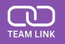

# Team Link

## Description

Team Link is my second development project, where I built on my existing knowledge of HTML, CSS, and JavaScript, while also diving into MongoDB, Express, and EJS for the first time. It’s an HR management app that lets users build and manage their company’s workforce. Having been involved in a Workday implementation as a Business Analyst, I’ve seen firsthand both the capabilities and limitations of a leading HR system. This project was a great opportunity to explore the technical side of that kind of platform and deepen my understanding of how the solutions I once helped define are actually built.

## Deployment Link

[Team Link](https://team-link-phi.vercel.app/)

## Getting Started/Code Installation

1. Clone Git repository: git clone https://github.com/jamiekaye9/team-link
2. Navigate into the project folder: cd team-link
3. Install dependencies: npm install
4. Create an env file inside the project folder, containing:
   - MONGODB_URI (your MongoDB token)
   - PORT (the port you are localling hosting the application on)
   - SESSION_SECRET (a secret key for the project)
5. Run 'npm start' in your terminal to start the server

## Timeframe & Working Team

This was a solo project, build in the timeframe of 1 week.

## Technologies Used

EJS, JavaScript, Express, CSS, Bcrypt.

## Brief

- Build a Node/Express/MongoDB application with full CRUD functionality.
- Utilise EJS Templates for rendering views to users.
- Use session-based authentication.
- The app should have at least one data entity in addition to the User model.
- At least one data entity must have a relationship with the User model.
- Guest users should not be able to create, update or delete data within the application.
- CSS Flexbox is utilised for page layout design.

## Planning

To plan this project, I used MVP User Stories, Stretch Goal User Stories, Wireframes and an ERD. This can all be found in the Trello link below. By creating well-thought-out, detailed wireframes, I was able to replicate them more easily through CSS styling; making the design process more focused and efficient.

[Planning Documentation](https://trello.com/invite/b/67a54527088349ac4dca06e8/ATTI844fb3af6eeffc5084aca4d00188fa9e16219B37/project-2)

## Build/Code Process

I began the project by defining my User and Company models, with the goal of making sure users could only perform CRUD operations within their own company. To achieve this, I used reference-based modelling by adding a 'companyID' field to the User schema. This approach laid the foundation for my broader goal: building a fully functional application that could eventually be used by the public.

Logo: 

Description: 

Team Link is an HR Management application. A user of the application has the option to join an existing company or create their own. When assigned to a company, a user has the ability to create and edit their workforce. The idea for this app came from my experience implementing Workday in my current job. I was inspired to design the processes and functionality that I have previously only learnt about from a front end perspective.

Attributions: 

To build this application, I used Canva to create a transparent logo

Technologies used: 

JavaScript, EJS, CSS, MongoDB, Bcrypt, Express

Next Steps: 

There are many additions than can be made to this app to increase its functionality. One idea would be to give the admin of a company the access to delete other users. Another might be to have notifications appear on the page if a worker is no longer assigned to a manager.
